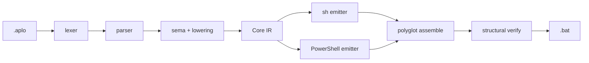

# Applows 開発エージェントガイド

## 概要

Applows は、シェル風の `.aplo` ソースを Windows Batch・Windows PowerShell 5.1・macOS `/bin/sh`・zsh で同時に動く単一 `.bat` へ変換する Rust 2024 コンパイラです。変更時は片方の OS だけでなく、両バックエンドの意味と生成物の構造を常に揃えてください。

## コンパイルパイプライン



## 主要ファイル

| パス | 責務 |
|---|---|
| `src/lexer.rs`, `src/parser.rs` | 字句解析と Source AST 構築 |
| `src/sema.rs` | 型検査、スコープ検査、Core IR への変換 |
| `src/emit/sh.rs` | macOS `/bin/sh`・zsh 用コード生成 |
| `src/emit/powershell.rs` | Windows PowerShell 5.1 用コード生成 |
| `src/bootstrap.rs`, `src/verify.rs` | ポリグロット組み立てと構造検査 |
| `tests/` | コンパイル、実行、フロントエンド、ゴールデンテスト |
| `docs/language.md` | 言語仕様の正本 |

## 必須の開発規約

- Rust コードとテストのコメントは、固有名詞やコード表記を除いて日本語で記述する。
- Source AST・Core IR・両エミッタの変更は、参照箇所をまとめて確認する。
- `.aplo` の型、構文、組み込み関数を変更した場合は `docs/language.md` と `skills/SKILL.md` も同期する。
- sh と PowerShell の動作差を新たに作らない。避けられない差は `docs/design.md` に明記する。
- 外部コマンドは argv として扱い、ユーザー入力を生成コードの構文位置へ直接埋め込まない。
- 再帰的に走査する構文を追加する場合は、深さ・複雑さ上限を迂回しないことを確認する。
- ゴールデン更新は意図した生成差分がある場合だけ `UPDATE_GOLDEN=1 cargo test --test golden` で行う。

## 検証コマンド

変更後は次の順で実行します。

```bash
cargo fmt --all
cargo clippy --all-targets -- -D warnings
cargo check --all-targets
cargo test --all-targets
cargo build --release
actionlint
cargo audit
```

`.aplo` ファイルを追加・変更した場合は、上記に加えて次を実行します。

```bash
applows check path/to/file.aplo
```

## テスト方針

- 境界値、異常系、OS 差、エスケープ、終了コードを優先する。
- コンパイラが不正入力で panic・abort せず、`Diagnostic` を返すことを固定する。
- sh 実行テストは `/bin/sh` と zsh の両方で同じ出力になることを確認する。
- Windows 固有挙動は GitHub Actions の Windows PowerShell 5.1 E2E で検証する。

## 関連資料

- [設計](./docs/design.md)
- [言語仕様](./docs/language.md)
- [英語 README](./README.md)
- [日本語 README](./README.ja.md)
