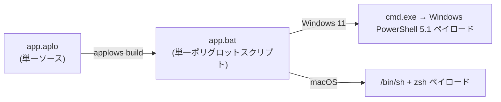

<h1 align="center">Applows</h1>

<p align="center">
  <strong>シェル風のソース 1 つから、素の Windows 11 と macOS の両方で追加ランタイム無しにそのまま動くポリグロットスクリプトを 1 つ生成。</strong>
</p>

<p align="center">
  <a href="https://github.com/owayo/Applows/actions/workflows/ci.yml">
    
  </a>
  <a href="LICENSE">
    
  </a>
</p>

<p align="center">
  <a href="README.md">English</a> | 日本語
</p>

---

## Applows とは

Applows は、シェル風の単一ソースファイル (`.aplo`) を、**素の Windows 11 と macOS の両方でネイティブに動く自己完結スクリプト (`.bat`) 1 つ**へコンパイルするコンパイラです。生成されるファイルは、同時に次の 3 つとして正しく解釈されます:

- **Windows Batch** (`cmd.exe`) — Windows 側のエントリポイント。PowerShell でスクリプトを起動し直す
- **Windows PowerShell 5.1** — Windows 側の本体ペイロード
- **macOS `/bin/sh` (bash) + `zsh`** — macOS 側の本体ペイロード

ブートストラップ・プロビジョニング・CI のスクリプトは、Python も Node.js も、時には Git さえも無い「OS 標準のものしか無い」マシンを相手にすることがよくあります。よくある対処は `setup.bat` と `setup.sh` を並行して維持することですが、2 つのスクリプトは次第に食い違っていきます。

Applows ならスクリプトを 1 度だけ書き、コンパイル時に静的型検査を受けたうえで、各 OS が標準搭載のインタプリタだけで実行できる単一ファイルを配布できます。ターゲットマシンにコピーして実行するだけです。

## 動作の仕組み

生成される `.bat` は、3 つのインタプリタのパース解釈の違いを突いたポリグロットです:

- **`cmd.exe`** はファイルを Batch として読む。Batch セクションが自身のパスを記録し、UTF-8 でファイルを再読込して Windows PowerShell 5.1 でペイロードを起動し直す
- **`/bin/sh` / `zsh`** はクォート付きヒアドキュメントで Batch セクション全体を読み飛ばし、sh ペイロードを実行して、PowerShell 部へ到達する前に `exit` する
- **PowerShell** は sh/Batch セクションを `REM @'...'@` の here-string 引数として無害に吸収し、PowerShell ペイロードを実行する



全体設計 (コンパイルパイプライン、エスケープ戦略、ビルド後の構造検査) は [docs/design.md](docs/design.md) を参照してください。

## 特徴

- **単一成果物** — 1 つの `.bat` で Windows 11 と macOS の両方をカバー。ターゲットマシンへのインストールは一切不要
- **静的検査** — `Text` / `Int` / `Bool` / `List` の型付き。暗黙の型変換や truthiness は無く、ミスはリモートマシン上ではなくコンパイル時に検出される
- **構造的にインジェクション耐性** — 外部コマンドは argv 配列 (`run(["git", "--version"])`) で渡し、各要素をターゲット別にクォート。ユーザ識別子は生成コードにそのまま現れない
- **ファイル操作** — 存在検査、読み込み・書き込み・追記・コピー・削除。書き込みはアトミック (一時ファイル + move)
- **HTTP ダウンロード** — `http_download(url, dest)` は macOS では `curl -fSL`、Windows では `Invoke-WebRequest` に写像され、アトミックに配置される
- **決定的な出力** — BOM 無し UTF-8・LF 固定。ビルドのたびに構造検査 (here-string 境界、ヒアドキュメント区切り、禁止行) を通す
- **Windows でも Unicode 安全** — スクリプトが自身を UTF-8 で再読込するため、日本語や絵文字が Windows PowerShell 5.1 でも壊れない
- **中間生成物を確認可能** — `applows emit` で sh ペイロード / PowerShell ペイロード / コンパイラ IR を表示できる
- **正直な終了コード** — スクリプトの終了ステータスは両 OS で呼び出し元へ伝播する

## 動作環境

**コンパイラのビルド**

- Rust 1.97 以上 (edition 2024)

**生成スクリプトの実行** — 以下はすべて OS 標準搭載。追加インストールは不要:

- Windows 11: `cmd.exe` + Windows PowerShell 5.1
- macOS: `/bin/sh` + `zsh`

## インストール

### ソースからビルド

```bash
git clone https://github.com/owayo/Applows.git
cd Applows
cargo build --release
# バイナリ: target/release/applows
```

### make install

```bash
make install   # リリースビルドして /usr/local/bin へコピー
```

### ビルド済みバイナリ

[GitHub Releases](https://github.com/owayo/Applows/releases) からダウンロードしてください。

## 使い方

```bash
applows build input.aplo [-o out.bat]              # ポリグロット .bat へコンパイル
applows check input.aplo                           # コンパイル可否のみ検査 (出力なし)
applows emit  input.aplo --target sh|powershell|ir # 中間生成物を表示
```

### `applows build`

| オプション | 説明 |
|-----------|------|
| `-o, --output <path>` | 出力先 (省略時は入力の拡張子を `.bat` に置き換えたパス) |
| `-n, --dry-run` | ファイルへ書き込まず、生成結果を標準出力へ表示 |

macOS/Unix では `build` が実行ビットも立てるため、`./out.bat` で直接起動できます。

### `applows check`

何も書き込まずにコンパイルし、エラーを報告します。成功時の終了コードは 0 です。

### `applows emit`

| オプション | 説明 |
|-----------|------|
| `--target sh` | sh ペイロードを表示 |
| `--target powershell` | PowerShell ペイロードを表示 |
| `--target ir` | コンパイラ IR を表示 (デバッグ用) |

`-h, --help` と `-V, --version` はすべてのコマンドで使用できます。

## 動かしてみる

`hello.aplo`:

```
let name = "world"
print "hello, {name}!"

# 外部コマンドは argv 配列で渡し、終了コードが返る
let code = run(["git", "--version"])
if code != 0 {
    print "git がインストールされていません"
    exit code
}
print "git を検出しました"
exit 0
```

コンパイルは 1 回だけ:

```bash
$ applows build hello.aplo
compiled: hello.aplo -> hello.bat
```

同じファイルを両方の OS で実行できます:

```bash
# macOS — コンパイラが実行ビットを立てるのでそのまま起動できる
./hello.bat
```

```bat
REM Windows 11 — cmd.exe から
hello.bat

REM PowerShell プロンプトからは
.\hello.bat
```

言語の主要機能を一通り使う実行可能なサンプルは [examples/tour.aplo](examples/tour.aplo) にあります。

## 言語の概要

```
# コメントは '#' で始まる

let count = 3                       # Int
let name = "world"                  # Text。`let` は宣言と再代入の両方

if count > 2 and name == "world" {  # truthiness は無い。条件は比較か Bool を返す組み込み
    print "big and world"
} else if count == 0 {
    print "zero"
} else {
    print "other"
}

while count > 0 {
    let count = count - 1
}

for i in 1 to 3 {                   # 両端を含む整数レンジ
    print "i={i}"
}
for fruit in ["apple", "banana"] {  # リスト反復
    print "fruit={fruit}"
}

fn greet(who) {                     # 値渡し。戻り値はステータスコード
    print "greet: {who}"
    return 0
}
greet("team")
```

押さえておくべきルール:

- 補間に書けるのは**変数名のみ** (`"{name}"`)。文字列の組み立ては補間だけで行い、`+` による連結は存在しない
- `==` / `!=` は同じ型同士のみ (`Int` は数値比較、`Text` は大文字小文字を区別する文字列比較)。`<` `<=` `>` `>=` と算術は `Int` 専用
- `Bool` は条件文脈にだけ存在し、変数へ格納できない
- 関数は値渡しで、外側の変数を変更できず、再帰もできない。戻り値はステータスコード

### 組み込み関数

| カテゴリ | 組み込み | 備考 |
|---|---|---|
| 出力 | `print`, `println` | 補間: `print "hello, {name}!"` |
| 引数・環境変数 | `args()`, `arg(i)`, `argc()`, `env(name, default)` | |
| プロセス | `run(argv)` | argv は `List`。終了コード (`Int`) を返す |
| ファイルシステム | `exists`, `is_file`, `is_dir`, `read_text`, `write_text`, `append_text`, `copy`, `remove` | `write_text` はアトミック (一時ファイル + move) |
| ネットワーク | `http_download(url, dest)` | `curl -fSL` / `Invoke-WebRequest` |
| テキスト | `upper`, `lower`, `trim` | |
| スクリプト位置 | `script_path()`, `script_dir()`, `cwd()` | |

文法・型規則・ターゲット別写像の完全な仕様は [docs/design.md](docs/design.md) を参照してください。

## 制限事項 (MVP)

- Unix 側ターゲットは汎用 POSIX `sh` ではなく、**macOS の `/bin/sh` (bash) と `zsh`** に限定。ポリグロットヘッダが `function` キーワードを使うため、`dash` (Debian/Ubuntu の既定 `/bin/sh`) では動作しない
- 未対応 (将来拡張): `run` の標準出力キャプチャ、正規表現、文字列 `replace`、辞書/オブジェクト、クロージャ、再帰、パイプライン、例外処理、非同期/並列
- 生の sh / PowerShell 埋め込みは提供しない (インジェクション安全性を保つための意図的な制限)
- Windows では `cmd.exe` のクォート解釈により、スクリプトへ転送する引数の一部文字 (`%` `!` `&` など) に制限がある。安全な範囲は E2E テストで固定している

## 開発

```bash
make build     # デバッグビルド
make test      # cargo test
make check     # clippy -D warnings + cargo check
make fmt       # cargo fmt
make release   # リリースビルド
```

テストは 4 層構成です ([docs/design.md](docs/design.md) 参照):

1. **ユニットテスト** — lexer / parser / sema / lower と、危険な文字集合 (引用符、`$`、`%`、`!`、空白、日本語、絵文字など) に対するクォート処理
2. **ゴールデンスナップショット** — 入力ごとに IR / sh ペイロード / PowerShell ペイロード / 最終 `.bat` を固定。`UPDATE_GOLDEN=1` で再生成
3. **領域単位の構文検査** — 抽出した sh ペイロードは `sh -n` / `zsh -n` を、PowerShell ペイロードは PowerShell 言語パーサを通す
4. **実 OS E2E** — GitHub Actions の `windows-latest` (Windows PowerShell 5.1) と `macos-latest` で検証

## ライセンス

MIT ライセンスです。[LICENSE](LICENSE) を参照してください。
