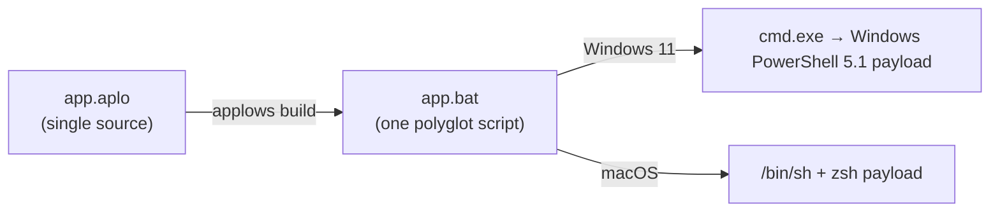

<h1 align="center">Applows</h1>

<p align="center">
  <strong>One shell-like source, one polyglot script — runs natively on vanilla Windows 11 and macOS with zero extra runtime.</strong>
</p>

<p align="center">
  <a href="https://github.com/owayo/Applows/actions/workflows/ci.yml">
    
  </a>
  <a href="LICENSE">
    
  </a>
</p>

<p align="center">
  English | <a href="README.ja.md">日本語</a>
</p>

---

## What is Applows?

Applows compiles a single shell-like source file (`.aplo`) into **one self-contained script (`.bat`) that runs natively on both vanilla Windows 11 and macOS**. The generated file is simultaneously valid as:

- **Windows Batch** (`cmd.exe`) — the entry point on Windows; it relaunches the script under PowerShell
- **Windows PowerShell 5.1** — the Windows payload
- **macOS `/bin/sh` (bash) + `zsh`** — the macOS payload

Bootstrap, provisioning, and CI scripts often target machines you do not control: no Python, no Node.js, not even Git — only what ships with the OS. The usual workaround is maintaining `setup.bat` and `setup.sh` side by side and watching them drift apart.

With Applows you write the script once, get static type checking at compile time, and ship a single file that each OS executes with its built-in interpreters. Copy it to the target machine, run it, done.

## How it works

The generated `.bat` is a polyglot built on parsing differences between the three interpreters:

- **`cmd.exe`** reads the file as Batch: the Batch section records the script's own path, re-reads the file as UTF-8, and relaunches the payload under Windows PowerShell 5.1.
- **`/bin/sh` / `zsh`** skip the entire Batch section through a quoted heredoc, run the sh payload, and `exit` before the PowerShell code is ever reached.
- **PowerShell** absorbs the sh/Batch sections as an inert `REM @'...'@` here-string argument, then runs the PowerShell payload.



The full design — compilation pipeline, escaping strategy, and post-build structural verification — is documented in [docs/design.md](docs/design.md).

## Features

- **Single-artifact output** — one `.bat` covers Windows 11 and macOS; nothing to install on target machines
- **Static checking** — typed (`Text` / `Int` / `Bool` / `List`), no implicit conversions, no truthiness; mistakes fail at compile time instead of on a remote machine
- **Injection-resistant by construction** — external commands take argv arrays (`run(["git", "--version"])`), each element is quoted for its target, and user identifiers never appear verbatim in the generated code
- **File operations** — existence tests, read/write/append/copy/remove, with atomic writes (temp file + move)
- **HTTP download** — `http_download(url, dest)` maps to `curl -fSL` on macOS and `Invoke-WebRequest` on Windows, with atomic placement
- **Deterministic output** — UTF-8 without BOM, LF-only line endings, structurally verified after every build (here-string boundaries, heredoc delimiters, forbidden lines)
- **Unicode-safe on Windows** — the script re-reads itself as UTF-8, so Japanese text and emoji survive Windows PowerShell 5.1
- **Inspectable** — dump the sh payload, the PowerShell payload, or the compiler IR with `applows emit`
- **Honest exit codes** — the script's exit status propagates to the caller on both operating systems

## Requirements

**Building the compiler**

- Rust 1.97+ (edition 2024)

**Running the generated scripts** — everything below ships with the OS; nothing to add:

- Windows 11: `cmd.exe` + Windows PowerShell 5.1
- macOS: `/bin/sh` + `zsh`

## Installation

### From source

```bash
git clone https://github.com/owayo/Applows.git
cd Applows
cargo build --release
# binary: target/release/applows
```

### make install

```bash
make install   # release build + copy to /usr/local/bin
```

### Prebuilt binaries

Download from [GitHub Releases](https://github.com/owayo/Applows/releases).

## Usage

```bash
applows build input.aplo [-o out.bat]              # compile to a polyglot .bat
applows check input.aplo                           # compile check only (no output)
applows emit  input.aplo --target sh|powershell|ir # print an intermediate artifact
```

### `applows build`

| Option | Description |
|--------|-------------|
| `-o, --output <path>` | Output path (default: the input path with its extension replaced by `.bat`) |
| `-n, --dry-run` | Print the generated script to stdout instead of writing a file |

On macOS/Unix, `build` also sets the executable bit so the output can be run directly as `./out.bat`.

### `applows check`

Compiles and reports errors without writing anything. Exits with code 0 on success.

### `applows emit`

| Option | Description |
|--------|-------------|
| `--target sh` | Print the sh payload |
| `--target powershell` | Print the PowerShell payload |
| `--target ir` | Print the compiler IR (for debugging) |

`-h, --help` and `-V, --version` are available on all commands.

## Quick example

`hello.aplo`:

```
let name = "world"
print "hello, {name}!"

# external commands take an argv array and return the exit code
let code = run(["git", "--version"])
if code != 0 {
    print "git is not installed"
    exit code
}
print "git detected"
exit 0
```

Compile once:

```bash
$ applows build hello.aplo
compiled: hello.aplo -> hello.bat
```

Run the same file on both operating systems:

```bash
# macOS — the compiler sets the executable bit
./hello.bat
```

```bat
REM Windows 11 — from cmd.exe
hello.bat

REM or from a PowerShell prompt
.\hello.bat
```

A complete, runnable tour of the language lives in [examples/tour.aplo](examples/tour.aplo).

## Language overview

```
# comments start with '#'

let count = 3                       # Int
let name = "world"                  # Text; `let` declares and reassigns

if count > 2 and name == "world" {  # no truthiness: conditions are comparisons / Bool built-ins
    print "big and world"
} else if count == 0 {
    print "zero"
} else {
    print "other"
}

while count > 0 {
    let count = count - 1
}

for i in 1 to 3 {                   # inclusive integer range
    print "i={i}"
}
for fruit in ["apple", "banana"] {  # list iteration
    print "fruit={fruit}"
}

fn greet(who) {                     # pass-by-value; returns a status code
    print "greet: {who}"
    return 0
}
greet("team")
```

Rules worth knowing:

- Interpolation takes **variable names only** (`"{name}"`) and is the only way to build strings — there is no `+` concatenation.
- `==` / `!=` compare values of the same type only (`Int` numerically, `Text` case-sensitively). `<` `<=` `>` `>=` and arithmetic are `Int`-only.
- `Bool` exists only in condition contexts and cannot be stored in a variable.
- Functions are pass-by-value, cannot modify outer variables, cannot recurse, and return a status code.

### Built-ins

| Category | Built-ins | Notes |
|---|---|---|
| Output | `print`, `println` | interpolation: `print "hello, {name}!"` |
| Arguments & environment | `args()`, `arg(i)`, `argc()`, `env(name, default)` | |
| Processes | `run(argv)` | argv as a `List`; returns the exit code (`Int`) |
| Filesystem | `exists`, `is_file`, `is_dir`, `read_text`, `write_text`, `append_text`, `copy`, `remove` | `write_text` is atomic (temp file + move) |
| Network | `http_download(url, dest)` | `curl -fSL` / `Invoke-WebRequest` |
| Text | `upper`, `lower`, `trim` | |
| Script location | `script_path()`, `script_dir()`, `cwd()` | |

The full grammar, type rules, and per-target mappings are specified in [docs/design.md](docs/design.md).

## Limitations (MVP)

- The Unix target is **macOS's `/bin/sh` (bash) and `zsh`** specifically — not generic POSIX `sh`. The polyglot header uses the `function` keyword, so `dash` (the default `/bin/sh` on Debian/Ubuntu) is not supported.
- Not yet available: capturing stdout of `run`, regular expressions, string `replace`, dictionaries/objects, closures, recursion, pipelines, exception handling, async/parallel execution.
- No raw sh / PowerShell embedding — a deliberate restriction that preserves the injection-safety guarantees.
- On Windows, `cmd.exe` quoting restricts some characters in arguments forwarded to the script (`%`, `!`, `&`, ...); the safe set is pinned by E2E tests.

## Development

```bash
make build     # debug build
make test      # cargo test
make check     # clippy -D warnings + cargo check
make fmt       # cargo fmt
make release   # release build
```

The test suite has four layers (see [docs/design.md](docs/design.md)):

1. **Unit tests** — lexer / parser / sema / lowering, plus quoting against hostile character sets (quotes, `$`, `%`, `!`, whitespace, Japanese, emoji, ...)
2. **Golden snapshots** — IR / sh payload / PowerShell payload / final `.bat` are pinned per input; regenerate with `UPDATE_GOLDEN=1`
3. **Region-wise syntax checks** — the extracted sh payload must pass `sh -n` / `zsh -n`; the PowerShell payload must parse with the PowerShell language parser
4. **Real-OS E2E** — GitHub Actions on `windows-latest` (Windows PowerShell 5.1) and `macos-latest`

## License

MIT — see [LICENSE](LICENSE).
