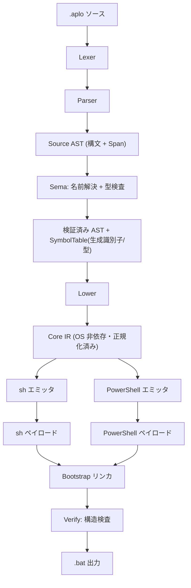

# Applows 設計仕様書

Applows は「シェル風の 1 つのソース (`.aplo`)」から、**バニラ Windows 11 と macOS の両方で追加ランタイムなしにネイティブ実行できる単一のポリグロットスクリプト (`.bat`)** を生成するコンパイラである。

出力ファイルは 1 つで、同時に次の 3 つとして正しく解釈される:

- **Windows Batch** (`cmd.exe`) — エントリポイント。PowerShell を起動し直す。
- **Windows PowerShell 5.1** — Windows 側の本体ペイロード。
- **macOS `/bin/sh` (bash) + zsh** — macOS 側の本体ペイロード。

> 注: Unix 側ターゲットは「macOS の `/bin/sh` (bash) と zsh」であり、汎用 POSIX sh (dash 等) ではない。ポリグロットヘッダは `function` キーワードを使うため dash では動作しない。これは Windows 11 + macOS という対象範囲に基づく意図的な割り切りである。

## コンパイルパイプライン

Codex とのアーキテクチャレビューの結論として、**AST から直接ターゲットコードを生成しない**。名前解決・型検査・正規化を挟む多段構成を採用する。



### 各段の責務

| 段 | モジュール | 責務 |
|---|---|---|
| Lexer | `lexer` | ソースをトークン列へ。位置 (Span) 付与。 |
| Parser | `parser` | 再帰下降で Source AST を構築。 |
| Sema | `sema` | 名前解決 (ユーザ識別子→生成識別子 `__ap_vN`)、型検査、比較の数値/文字列判定、禁止事項の検出。 |
| Lower | `lower` | 検証済み AST を Core IR へ正規化。 |
| Emit | `emit::sh` / `emit::powershell` | Core IR を各ターゲット構文へ。エスケープは用途別 API に閉じる。 |
| Link | `bootstrap` | 検証済みポリグロットテンプレートへ 2 ペイロードを差し込み。 |
| Verify | `verify` | 出力の構造検査 (BOM 無し / LF のみ / here-string 境界 / 禁止行)。 |

## 型システム (MVP)

暗黙の型変換・truthiness は持たない。条件文脈にだけ真偽値が存在する。

| 型 | 説明 |
|---|---|
| `Text` | Unicode スカラ値の列 (UTF-8)。NUL 禁止。 |
| `Int` | 符号付き 64bit 整数。 |
| `Bool` | 条件文脈専用。値として代入・格納できない。 |
| `List` | `List<Text>` 相当。主に `run` の argv と `for` の反復に使う。 |

- 比較 `==` `!=`: 同じ型同士のみ。`Int` 同士は数値比較、`Text` 同士は (大文字小文字を区別する) 文字列比較。
- 比較 `<` `<=` `>` `>=`: `Int` 同士のみ。
- 算術 `+ - * / %`: `Int` のみ。
- 文字列連結は `+` ではなく**補間** `"...{var}..."` で行う (演算子の多重定義を避ける)。

## 構文 (MVP)

```
# コメント

let name = "world"          # 変数宣言/再代入
let count = 3

print "Hello, {name}!"      # 補間付き出力 (改行あり)
println("explicit call form も可")

if count > 2 and exists("/tmp") {
    print "big"
} else if name == "world" {
    print "hi world"
} else {
    print "other"
}

while count > 0 {
    print "count={count}"
    let count = count - 1
}

for x in 1 to 3 {           # 両端含む整数レンジ
    print "x={x}"
}

for f in ["a", "b", "c"] {  # リスト反復
    print "f={f}"
}

fn install(pkg) {           # 関数: 値渡し / 再帰不可 / 外側変数変更不可 / 戻り値は Status
    return run(["echo", "installing", pkg])
}
install("foo")

let code = run(["git", "--version"])   # 外部コマンドは argv 配列。戻り値は終了コード(Int)
if code != 0 {
    exit code
}

exit 0
```

## 組み込み関数 (MVP)

すべて sh と PowerShell 5.1 の双方へ安全に写像できるものだけを選定した。

| 関数 | 引数 | 戻り | sh | PowerShell |
|---|---|---|---|---|
| `print` / `println` | Text | — | `printf '%s\n'` | `[Console]::Out.WriteLine` |
| `env(name, default)` | Text, Text | Text | `${NAME:-default}` | `$env:NAME` ?? default |
| `args()` / `arg(i)` / `argc()` | — / Int / — | List/Text/Int | `$@` / `$1` / `$#` | `$__ap_args` |
| `run(list)` | List | Int(終了コード) | argv を quote して実行 | `& argv[0] argv[1..]` |
| `exists/is_file/is_dir(path)` | Text | Bool | `[ -e/-f/-d ]` | `Test-Path` |
| `read_text(path)` | Text | Text | `IO.File`相当(cat) | `[IO.File]::ReadAllText(,UTF8)` |
| `write_text(path,text)` | Text,Text | — | 一時ファイル→mv (原子的) | `[IO.File]::WriteAllText` (UTF-8 BOM 無し) |
| `append_text(path,text)` | Text,Text | — | `>>` | `[IO.File]::AppendAllText` |
| `copy(from,to)` / `remove(path)` | Text,Text / Text | — | `cp` / `rm` | `Copy-Item` / `Remove-Item` |
| `http_download(url,dest)` | Text,Text | Int | `curl -fSL`→一時→mv | `Invoke-WebRequest`→一時→mv |
| `upper/lower/trim(s)` | Text | Text | `tr` / `sed` | `.ToUpper()/.ToLower()/.Trim()` |
| `script_path()/script_dir()/cwd()` | — | Text | `$0`/`dirname`/`$PWD` | `$env:APPLOWS_SELF` 由来 |

MVP から除外 (将来拡張): 任意コード埋め込み、stdout キャプチャ、正規表現、リテラル置換 `replace`、辞書/オブジェクト、クロージャ、再帰、パイプライン、例外処理、非同期/並列。

## ブートストラップ (ポリグロットテンプレート)

`bootstrap.rs` が保持する検証済み固定テンプレート。3 環境のパーサ解釈ギャップを突いて共存する。

```
#!/bin/sh
function REM() { return; }
REM @'
REM '; : << 'APPLOWS_BATCH'
@echo off
setlocal DisableDelayedExpansion
set "APPLOWS_SELF=%~f0"
"%SystemRoot%\...\powershell.exe" -NoProfile -ExecutionPolicy Bypass -Command "try { <引数を GetCommandLineArgs で取得>; <UTF-8 で自身を再読込>; & $b @a; exit 0 } catch { ...; exit 1 } #" %*
set "__ap_rc=%ERRORLEVEL%"
endlocal & exit /b %__ap_rc%
APPLOWS_BATCH
<< sh ペイロード >>
exit 0
'@
<< PowerShell ペイロード >>
```

- **sh**: `function REM` を定義 → 行 3-4 の単一引用符がまたがり REM 呼び出し → `: << 'APPLOWS_BATCH'` ヒアドキュメントで Batch 部を読み飛ばし → sh ペイロード実行 → `exit 0` で PowerShell 部到達前に終了。
- **Batch**: `REM` はコメント予約語 → 行 1-2 の 2 行だけ良性エラー (`@echo off` 後に発生) → Batch 部実行 → `exit /b` で終了。
- **PowerShell**: `function REM` 定義 → `REM @'...'@` を single-quote here-string 引数として sh/Batch 部を丸ごと無害に吸収 → PowerShell ペイロード実行。

### P0 対策 (Codex レビューで確定)

1. **自己パス**: Batch が `set "APPLOWS_SELF=%~f0"` で束縛し、環境変数として PowerShell へ渡す。`$PSScriptRoot`/`$PSCommandPath` は `iex`/`ScriptBlock` 経由で空になるため依存しない。
2. **UTF-8 自己再読込**: `Get-Content` は BOM 無し UTF-8 を UTF-8 と読まない場合があり日本語が壊れる。`[System.IO.File]::ReadAllText($env:APPLOWS_SELF, (New-Object System.Text.UTF8Encoding $false))` + `[ScriptBlock]::Create` を使う。
3. **BOM 無し UTF-8 / LF 固定**: 出力は必ず BOM 無し UTF-8・LF。出力直後に再読込して検査。`.gitattributes` で変換禁止。
4. **引数転送** (Codex レビューで罠を確定・修正): `powershell -Command "..." %*` では **`%*` は `$args` にならず**、PowerShell 5.1 の仕様上コマンド文字列末尾へ連結される (公式仕様)。そのため素朴な実装は「引数なしは動くが引数ありは構文破壊」する。対策として、
   - ネイティブのプロセス引数を `[Environment]::GetCommandLineArgs()` で取得 (固定フラグ構成なので index 6 以降がユーザ引数)。UTF-16 で保持されるため日本語も安全。
   - `-Command` 文字列末尾の `#` で、PowerShell が連結してくる `%*` をコメント化し二次評価 (`$env:X` / `$(...)` の展開) を防ぐ。
   - `setlocal DisableDelayedExpansion` で引数中の `!` 消失を防止。
   - `powershell.exe` をフルパス (`%SystemRoot%\System32\WindowsPowerShell\v1.0\powershell.exe`) で起動し 5.1 を明示。
   - なお `%*` は cmd.exe を再通過するため、不均衡な `"`・未引用の `& | < >`・改行を含む引数は依然制限として仕様に明記する。
5. **明示的 exit code**: `$LASTEXITCODE` に依存せず、runtime で `$__ap_status` を管理し `exit [int]$__ap_status`。Batch も `exit /b %ERRORLEVEL%`。

### Verify (構造検査)

出力後に機械検査し、1 つでも違反があればコンパイルエラー:

- UTF-8 BOM が無い / NUL が無い
- 改行が LF のみ (CR を含まない)
- here-string 開始 `@'` と終了 `'@` がちょうど 1 組
- sh ペイロード領域・here-string 内に行頭 `'@` が現れない (PowerShell here-string の早期終了防止)
- `APPLOWS_BATCH` ヒアドキュメント区切りが期待位置にのみ存在

## 識別子とエスケープ戦略

原則: **ユーザ入力を生成コードの構文として扱わない**。

- ユーザ変数/関数はすべて生成識別子 (`__ap_vN` / `__ap_fN`) へ写像。sh/PS の特殊変数 (`PATH`, `args`, `PSHOME` 等) との衝突を根絶。
- sh 文字列は single quote 基本。`'` は `'\''` で分割エスケープ。
- PowerShell 文字列は single quote 基本。`'` は `''` で二重化。
- 外部コマンドは argv 構造を保持し、各要素を個別に quote。
- 任意の raw sh / raw PowerShell 埋め込みは提供しない。

## テスト戦略 (4 層)

1. **ユニット**: lexer/parser/sema/lower、sh・PS の quoting、argv 変換、エラー位置。Codex 指定の文字集合 (`' " \` $ % ! ^ & | < >`、空白、日本語、絵文字、空文字列、末尾バックスラッシュ) を網羅。
2. **ゴールデン (スナップショット)**: 入力 `.aplo` に対し IR / sh ペイロード / PS ペイロード / 最終 `.bat` を個別に固定。`UPDATE_GOLDEN=1` で再生成。
3. **構文検査**: **領域単位で行う**。生成物全文に `sh -n` を掛けると PowerShell 領域の未対応引用符で必ず落ちるため不可 (sh は逐次読み込み実行で `exit` により PS 領域へ到達せず正常動作するが、`-n` は全文パースするため落ちる)。よって sh ペイロード領域を抽出して `/bin/sh -n` / `zsh -n`、PowerShell ペイロード領域を抽出して `[System.Management.Automation.Language.Parser]::ParseInput` を掛ける。全文の言語横断妥当性は実行 (E2E) と Verify で担保する。

### ブートストラップ検証結果 (macOS 実測済み)

プロトタイプを macOS の `/bin/sh` (bash 3.2) と `/bin/zsh` で実行し、以下を確認済み:

- sh ペイロードが正しく実行される
- 自己パス (`$0`) と自己ディレクトリ (`dirname`) が取得できる
- 引数 (空白入り・日本語含む) が `"$@"` で正しく渡る
- UTF-8 (`こんにちは 🌏 café`) が文字化けせず出力される
- 終了コード (`exit 7`) が呼び出し元へ伝播する
- 抽出した sh ペイロードが `sh -n` / `zsh -n` を通過する

Windows 側 (Batch + Windows PowerShell 5.1) は CI (`windows-latest`) の E2E で検証する。
4. **実 OS E2E**: GitHub Actions `windows-latest` (Windows PowerShell 5.1 明示) + `macos-latest`。引数 (空/空白/日本語/記号)、環境変数、相対パス、自己ディレクトリ、ファイル読み書き、非ゼロ終了、stdout/stderr を検証。
