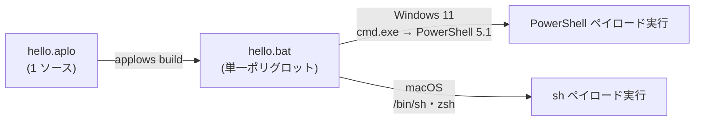
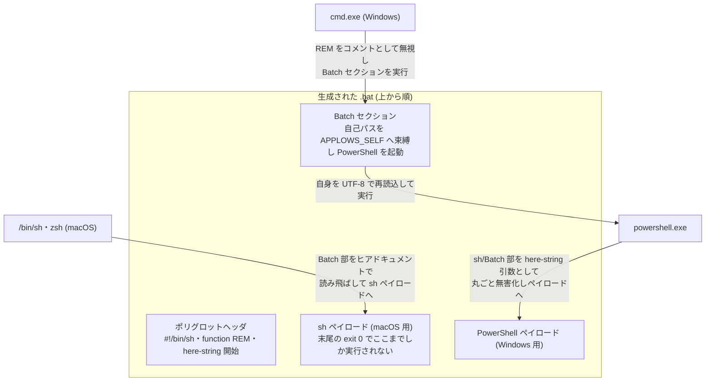

# Applows 言語リファレンス

Applows は、シェル風の 1 つのソースファイル (`.aplo`) から、**バニラの Windows 11 と macOS の両方で追加ランタイムなしに動く単一のスクリプト (`.bat`)** を生成するコンパイラです。生成物は 1 ファイルで、Windows Batch・Windows PowerShell 5.1・macOS `/bin/sh`(bash)+zsh の 3 環境で同時に正しく解釈される「ポリグロットスクリプト」になっています。

この文書は **Applows 言語を書く利用者向けの完全なリファレンス**です。コンパイラ内部の設計 (パイプライン・ブートストラップ機構・テスト戦略) は [design.md](design.md) を参照してください。動くコード全体を眺めたい場合は [examples/tour.aplo](../examples/tour.aplo) が全構文を一通り使っています。

## 目次

- [1. 概要](#1-概要)
- [2. 設計原則](#2-設計原則)
- [3. コンパイルと実行](#3-コンパイルと実行)
- [4. 字句要素](#4-字句要素)
- [5. 型システム](#5-型システム)
- [6. 変数と let](#6-変数と-let)
- [7. 文字列補間](#7-文字列補間)
- [8. 演算子](#8-演算子)
- [9. print 文](#9-print-文)
- [10. 制御構造](#10-制御構造)
- [11. 関数](#11-関数)
- [12. 外部コマンド実行 (run)](#12-外部コマンド実行-run)
- [13. 組み込み関数リファレンス](#13-組み込み関数リファレンス)
- [14. exit 文](#14-exit-文)
- [15. 生成される .bat の構造](#15-生成される-bat-の構造)
- [16. 既知の制限](#16-既知の制限)

## 1. 概要



最小の例:

```applows
# hello.aplo
let name = env("USER_NAME", "world")
print "Hello, {name}!"
exit 0
```

```console
$ applows build hello.aplo
compiled: hello.aplo -> hello.bat

$ ./hello.bat          # macOS (実行ビット付与済み)
Hello, world!

C:\> hello.bat         # Windows 11 (cmd.exe)
Hello, world!
```

コンパイル済みの `.bat` 1 ファイルを配れば、受け取った側は Windows でも macOS でも何もインストールせずに実行できます。

## 2. 設計原則

Applows は「シェルスクリプトの移植性問題」を言語仕様の厳格さで解決します。次の原則がすべての構文・型規則の背景にあります。

| 原則 | 内容 |
|---|---|
| **暗黙変換なし** | 型の暗黙変換・truthiness (空文字列や 0 を偽扱いする規則) は存在しない。`if name { ... }` は書けない。 |
| **Bool は条件専用** | 真偽値は `if` / `while` の条件にだけ現れる。変数へ代入したり print したりはできない。 |
| **List は run / for 専用** | リストは `run(...)` の argv と `for` の反復にのみ使える。変数へ束縛できない。 |
| **補間は変数名のみ** | 文字列補間 `{x}` に書けるのは変数名だけ。式や関数呼び出しは `let` で受けてから補間する。 |
| **ユーザ入力を構文にしない** | 変数の内容が生成コードのシェル構文として解釈されることはない (すべて single quote で防護)。`rm -rf $DIR` 型の事故が構造的に起きない。 |
| **両 OS へ安全に写像できる機能だけ** | 組み込み関数は sh と PowerShell 5.1 の双方で同じ意味になるものだけを厳選している。 |

制約が多い代わりに、「コンパイルが通れば両 OS で同じように動く」ことを最優先しています。

## 3. コンパイルと実行

### CLI

| コマンド | 動作 |
|---|---|
| `applows build <input.aplo>` | ポリグロット `.bat` を生成する。出力先は入力の拡張子を `.bat` に変えたもの。 |
| `applows build <input.aplo> -o <out.bat>` | 出力先を指定する。 |
| `applows build <input.aplo> --dry-run` (`-n`) | ファイルへ書かず生成結果を標準出力へ表示する。 |
| `applows check <input.aplo>` | コンパイルの可否だけを検査する (出力しない)。CI での検証に。 |
| `applows emit <input.aplo> --target sh\|powershell\|ir` | 中間生成物 (sh ペイロード / PowerShell ペイロード / Core IR) を表示する。デバッグ用。 |

### 実行方法

- **macOS**: `build` が実行ビットを付与するので `./hello.bat` で直接実行できる (`#!/bin/sh` シバン)。`sh hello.bat` / `zsh hello.bat` でも同じ。
- **Windows 11**: cmd から `hello.bat`、PowerShell から `.\hello.bat`。標準搭載の Windows PowerShell 5.1 を `-ExecutionPolicy Bypass` で起動し直すため、実行ポリシーの設定は不要。
- `exit` で指定した終了コードは両 OS とも呼び出し元へ伝播する。

### コンパイルエラーの読み方

エラーは位置情報つきで報告され、終了コードは非 0 になります。

```console
$ applows check bad.aplo
error: 未定義の関数 `println`
  --> bad.aplo:1:1
1 | println("x")
    ^
```

### 配布時の注意 (改行コード)

生成される `.bat` は **BOM 無し UTF-8・改行 LF** であることが動作の前提です (コンパイラが出力後に機械検査します)。Git で配布する場合は CRLF 自動変換で壊れないよう `.gitattributes` で守ってください。

```gitattributes
*.bat -text
```

## 4. 字句要素

### ソースファイル

- エンコーディングは UTF-8。文字列リテラルには日本語・絵文字を含められる。
- 文は **1 行 1 文**。文末のセミコロンは無い (`;` はエラーになる)。
- 丸括弧 `( )` と角括弧 `[ ]` の内側では改行できるため、長い呼び出しやリストは複数行に折り返せる。

```applows
let code = run([
  "git",
  "clone",
  "https://example.com/repo.git",
])
```

- ブロック `{ }` は改行を挟むのが基本だが、短い場合は 1 行にも書ける: `if n == 0 { print "zero" }`

### コメント

`#` から行末までがコメント。行頭でも行の途中でも書ける。ブロックコメントは無い。

```applows
# 行全体のコメント
let n = 1   # 行末コメント
```

### 識別子

- 先頭は ASCII 英字または `_`、2 文字目以降は ASCII 英数字と `_`。
- 大文字小文字は区別される。日本語などの非 ASCII 文字は識別子に使えない。
- 次の **予約語** は識別子にできない:

```
let print if else while for in to fn return exit and or not true false
```

### 整数リテラル

- 10 進のみ。`_` を桁区切りとして自由に挟める (無視される): `1_000_000`
- 値は符号付き 64bit (`Int`)。リテラルとして書ける最大値は `9223372036854775807`。
- 負数は単項マイナスで書く: `let n = -42`

### 文字列リテラル

`"..."` で囲む。使えるエスケープは次の 7 つだけで、それ以外の `\x` はコンパイルエラー。

| エスケープ | 意味 |
|---|---|
| `\n` | 改行 (LF) |
| `\t` | タブ |
| `\r` | 復帰 (CR) |
| `\\` | バックスラッシュ |
| `\"` | 二重引用符 |
| `\{` | 開き波括弧 (リテラル) |
| `\}` | 閉じ波括弧 (リテラル) |

```applows
let s = "1行目\n2行目"
print "JSON 風: \{ \"key\": 1 \}"
```

文字列の途中に生の改行を書くこともできる (複数行リテラル) が、読みやすさのため `\n` を推奨。

`{` をエスケープせずに書くと文字列補間 ([7 章](#7-文字列補間)) として解釈される。

## 5. 型システム

値の型は 4 つ。暗黙の型変換はありません。

| 型 | 説明 | 使える場所 |
|---|---|---|
| `Text` | Unicode 文字列 (UTF-8)。NUL 不可。 | 値 (代入・補間・print・引数) |
| `Int` | 符号付き 64bit 整数。 | 値 (代入・補間・print・引数・算術) |
| `Bool` | 真偽値。 | **`if` / `while` の条件のみ** |
| `List` | `List<Text>` 相当。 | **`run` の argv と `for` の反復のみ** |

規則をコード例で:

```applows
let ok = exists("data")   # エラー: `exists` は Bool を返すため値にできません
let flag = 1 < 2          # エラー: 真偽値は値として使えません
let xs = ["a", "b"]       # エラー: リストは値として使えません
print exists("data")      # エラー: Bool は print できません
```

正しい書き方:

```applows
if exists("data") {
  print "found"
}
for x in ["a", "b"] {
  print "{x}"
}
```

型変換について:

- `Int` は補間・`print` の中では自動的に 10 進の文字列表現になる (これが唯一の自動的な文字列化)。
- `Text` を `Int` に変換する手段は無い (MVP)。`arg()` や `env()` で受けた値は `Text` なので算術には使えない。

## 6. 変数と let

### 宣言と再代入

宣言も再代入も同じ `let` 構文です。

```applows
let count = 3        # 宣言
let count = count - 1  # 再代入
```

- 代入できるのは `Text` と `Int` のみ (`Bool` / `List` は不可)。
- 変数の型は**最後に代入した値の型**。別の型で再代入するとその型に変わる (可能だが、混乱のもとなので推奨しない)。

### スコープ規則

スコープは **グローバル (トップレベル)** と **関数ごと** の 2 種類だけです。シェルと同じく、`if` / `while` / `for` のブロックは新しいスコープを作りません。

```applows
if exists("config.txt") {
  let state = "found"
} else {
  let state = "missing"
}
print "state={state}"   # ブロック内の let はブロック後も見える

for i in 1 to 3 {
  print "{i}"
}
# ループ変数 i もループ後に残る (値には依存しないこと)
```

注意点:

- **使う前に必ず代入する**こと。実行されなかった分岐の中だけで `let` した変数を後から参照すると、実行時には空の値になり (0 にはならない)、数値比較などが壊れる。分岐で初めて代入する変数は、分岐の前に初期値を `let` しておくのが安全。
- 関数の中はグローバルと完全に分離される ([11 章](#11-関数))。
- 変数と関数は名前空間が別 (組み込み関数と同名の変数も作れる) だが、紛らわしいので避ける。

## 7. 文字列補間

文字列の中の `{変数名}` はその変数の値に置き換わります。文字列の連結演算子は無く、**連結も補間で行います**。

```applows
let user = "alice"
let count = 3
print "hello, {user}! ({count} 回目)"   # Text も Int も補間できる

let a = "foo"
let b = "bar"
let joined = "{a}{b}"                    # 連結は隣接補間で
```

**補間に書けるのは変数名だけ**です。式・関数呼び出しは書けません。

```applows
print "{upper(name)}"    # エラー: 補間 `{...}` が `}` で閉じられていません
print "{n + 1}"          # エラー
```

関数の結果は `let` で受けてから補間します。

```applows
let u = upper(name)
print "{u}"
```

- スコープに無い変数を補間するとコンパイルエラー (`未定義の変数`)。
- `Bool` / `List` 型のものは補間できない。
- リテラルの波括弧は `\{` `\}` と書く。

## 8. 演算子

### 優先順位

低い方から高い方へ。同じ段は左結合です。

| 優先順位 | 演算子 | 種別 |
|---|---|---|
| 1 (最低) | `or` | 論理和 |
| 2 | `and` | 論理積 |
| 3 | `not` | 論理否定 (単項) |
| 4 | `==` `!=` `<` `<=` `>` `>=` | 比較 |
| 5 | `+` `-` | 加減算 |
| 6 | `*` `/` `%` | 乗除算・剰余 |
| 7 | `-` (単項) | 符号反転 |
| 8 (最高) | リテラル・変数・呼び出し・`( )` | 一次式 |

`not` は比較より弱く結合するため、`not a == 2` は `not (a == 2)` と解釈されます。グループ化には `( )` を使えます。

### 算術演算子 (`+ - * / %`)

- **`Int` 同士のみ**。`Text` に `+` を使うとエラー (`"a" + "b"` は不可 — 連結は補間で)。
- `/` は整数除算 (切り捨て) を意図しているが、割り切れない除算は現状 OS 間で結果が一致しない可能性がある ([16 章](#16-既知の制限))。割り切れる値か、`%` との併用で使うのが安全。
- `%` は剰余。結果の符号は被除数に従う (`-7 % 2` は `-1`)。

```applows
let n = 7
let q = n / 2      # 3
let r = n % 2      # 1
let x = (n + 1) * 2
```

### 比較演算子 (`== != < <= > >=`)

- **両辺は同じ型**でなければならない。
- `Int` 同士: 6 種すべて使える (数値比較)。
- `Text` 同士: `==` `!=` のみ。**大小比較 (`<` など) はエラー**。比較は大文字小文字を区別する。
- `Bool` / `List` は比較できない。
- 比較の連鎖は禁止: `0 < a < 2` はエラー。`0 < a and a < 2` と書く。

```applows
if name == "world" { print "hi" }
if count >= 10 { print "many" }
if "a" < "b" { }    # エラー: 文字列の大小比較はできません (== != のみ)
```

### 論理演算子 (`and` `or` `not`)

オペランドは `Bool` (比較式・Bool 組み込み・`true`/`false`)。結果も `Bool` なので条件の中でしか使えません。

```applows
if count > 2 and exists("/tmp") {
  print "big"
}
if not is_file(path) or size == 0 {
  print "empty"
}
```

### true / false

`true` と `false` は**条件文脈専用**のリテラルです。値として代入はできません (`let b = true` はエラー)。主な用途は `while true` です。

## 9. print 文

```applows
print <式>
```

- 式の型は `Text` または `Int`。評価結果を**改行付き**で標準出力へ書く。
- `Bool` / `List` は print できない。
- 出力は UTF-8。改行コードは各 OS の慣例に従う (macOS: LF / Windows: CRLF)。

```applows
print "Hello"
print "count={count}"   # 補間
print count * 2         # 式も書ける
let msg = "direct"
print msg               # 変数を直接
```

> 注: 設計仕様書の初期案にあった `println(...)` 呼び出し形は MVP 実装には存在しません。`print` 文だけを使ってください。

## 10. 制御構造

### 条件に書けるもの

条件 (`if` / `while` の直後) に書けるのは **`Bool` になる式**だけです。

| 書けるもの | 例 |
|---|---|
| 比較式 | `count > 0`、`name == "world"` |
| 論理結合 | `a == 1 and not is_dir(p)` |
| `true` / `false` | `while true` |
| Bool を返す組み込み | `exists(p)`、`is_file(p)`、`is_dir(p)` |
| 比較の項としての呼び出し | `run(["git", "--version"]) == 0`、`myfunc() == 0` |

書けないもの: 裸のユーザ関数呼び出し (`if ok() { }` はエラー)、`Text` / `Int` の値そのもの (truthiness は無い)。

### if / else if / else

```applows
if count > 2 and name == "world" {
  print "big and world"
} else if count == 0 {
  print "zero"
} else {
  print "other"
}
```

`else if` は何段でも連ねられます。`else` は省略可能です。

### while

前置判定ループです。**`break` / `continue` はありません**。抜ける手段は「条件を偽にする」か「`exit` でスクリプト全体を終える」の 2 つです。

```applows
let n = 3
while n > 0 {
  print "n={n}"
  let n = n - 1
}
```

`while true` は無限ループになります (どこかの分岐で `exit` すること)。

### for (整数レンジ)

```applows
for i in 1 to 3 {
  print "i={i}"     # 1, 2, 3 — 両端を含む
}
```

- `A to B` は **両端を含む**昇順レンジ。ループ変数は `Int` 型。
- 両端には `Int` の式を書ける: `for i in start to start + 9 { ... }`
- 開始 > 終了なら本体は 1 回も実行されない。下降レンジは無い。

### for (リスト)

```applows
for fruit in ["apple", "banana", "cherry"] {
  print "fruit={fruit}"
}

for a in args() {          # スクリプト引数の反復
  print "arg={a}"
}
```

- 反復対象はリストリテラル `[...]` か `args()` のみ (リスト変数は存在しない)。
- 要素には `Text` / `Int` の式を書けるが、**ループ変数は常に `Text` 型**。`for x in [1, 2] { let y = x + 1 }` は型エラーになる。

ループ変数はどちらの形でもループ後にスコープへ残りますが、その値に依存しないでください。

## 11. 関数

### 定義と呼び出し

```applows
fn greet(who, salute) {
  let msg = "{salute}, {who}!"
  print msg
  return 0
}

greet("team", "Hello")      # 文として呼ぶ (Status を捨てる)
let st = greet("you", "Hi") # Status を受ける
if st == 0 { print "ok" }
```

- 定義は `fn 名前(パラメータ, ...) { 本体 }`。**トップレベルでのみ**定義できる (ブロックや関数の中はエラー)。
- 同名の二重定義、組み込み関数と同名の定義はエラー。
- 呼び出しは「文として」(Status を捨てる) 書くか、結果を **`Int` の値**として任意の値文脈 (`let`・比較・算術・引数・`print`) で使える。裸のまま条件には書けない (`if f() { }` はエラー — `if f() == 0 { }` と比較する)。

### パラメータは値渡し・すべて Text

- 引数には `Text` / `Int` を渡せるが、**関数の中ではすべて `Text` 型**として見える (MVP の仕様)。したがってパラメータに対する算術はできない。

```applows
fn f(n) {
  let m = n + 1   # エラー: 型が一致しません: Int を期待しましたが Text でした
  return 0
}
```

- 補間 (`"{n}"`) や `==` / `!=` 比較、他の関数・組み込みへの受け渡しは可能。
- **値渡し**なので、関数内でパラメータを再代入しても呼び出し元の変数は変わらない。

### 戻り値は Status (Int)

- 関数の戻り値は終了ステータス相当の `Int` のみ。`0` を成功とする慣例。
- `return <Int 式>` で返す。`return` 単独、または末尾に到達した場合は `0`。
- `return "text"` は型エラー。`return` はトップレベルでは使えない (`exit` を使う)。

```applows
fn check(path) {
  if exists(path) {
    return 0
  }
  return 1
}
```

### 禁止事項 (コンパイルエラー)

| 禁止 | 内容 |
|---|---|
| 再帰・相互再帰・前方参照 | 関数から呼べるのは**自分より前に定義された関数だけ**。`f` の中で `f` 自身や、後で定義される `g` は呼べない。 |
| 外側変数の参照 | 関数の中からトップレベルの変数は見えない (`未定義の変数` エラー)。必要な値はすべて引数で渡す。 |
| ネスト定義 | 関数の中で `fn` は書けない。 |

```applows
fn a() {
  return b()   # エラー: 関数 `b` を呼べません (再帰・前方参照は禁止)
}
fn b() {
  return 0
}
```

### その他の規則

- 関数内の `let` はその関数のローカル変数。呼び出し元には影響しない。
- 関数内で `exit` を使うと (return と違い) **スクリプト全体が**その場で終了する。
- `arg()` / `args()` / `argc()` は**トップレベル専用**。関数内で使うとコンパイルエラーになる (`` `arg` はトップレベルでのみ使えます ``)。引数の値が必要な場合はトップレベルで受けてから関数へ渡す。

```applows
fn show(v) {
  print "arg={v}"
  return 0
}
let first = arg(1)   # トップレベルで受けて
show(first)          # 関数へ渡す
```

## 12. 外部コマンド実行 (run)

```applows
let code = run(["git", "--version"])   # argv 配列で渡す
if code != 0 {
  exit code
}

run(["git", "fetch", "--all"])         # 文として (終了コードを捨てる)

if run(["git", "diff", "--quiet"]) == 0 {
  print "clean"
}

let st = run(args())                   # 自分の引数をそのまま別コマンドとして実行
```

- 引数は **必ず argv 配列** (`[...]` リテラルまたは `args()`)。先頭要素がコマンド、残りが引数。コマンドは PATH から探索される。空のリストはコンパイルエラー (`run([])` は不可)。
- 要素には `Text` / `Int` の式 (変数・補間・組み込み呼び出し) を書ける。各要素は**そのまま 1 引数**として渡る — 空白や記号を含んでいても分割・展開されない。
- 戻り値は終了コード (`Int`)。
- **シェルを経由しない**: パイプ `|`、リダイレクト `>`、ワイルドカード `*`、`&&` などのシェル構文は使えない (書いてもただの文字として渡る)。
- 標準出力・標準エラーは画面へそのまま流れる。**stdout のキャプチャはできない** (MVP)。

### 移植性の注意

- 呼び出すコマンド自体の存在は Applows は保証しない。両 OS に存在する実行ファイル (`git`、`curl` など、インストール済みのもの) を使うこと。`ls` / `dir`、`open` / `start` のような OS 固有コマンドは避ける。
- コマンドが見つからないときの挙動が OS で異なる: macOS では終了コード 127 が返り継続するが、**Windows では実行時エラーでスクリプト全体が終了コード 1 で停止する**。
- Windows 側は PowerShell の `&` 演算子で起動するため、コマンド名が PowerShell の関数・エイリアス (`mkdir` など) に解決されると終了コードが取得できないことがある。**ネイティブ実行ファイル**を呼ぶこと。
- OS を判定したい場合の小技: Windows は環境変数 `OS=Windows_NT` を必ず持つため、`env("OS", "unix")` の結果を比較すれば分岐できる。

```applows
let os = env("OS", "unix")
if os == "Windows_NT" {
  print "on Windows"
} else {
  print "on macOS"
}
```

## 13. 組み込み関数リファレンス

### 一覧

「文脈」列は、その呼び出しを書ける場所: **値** = `let` / `print` / 引数、**条件** = `if` / `while` の条件、**文** = 単独の文 (結果を捨てる)、**リスト** = `run` の argv / `for` の反復対象。

| 関数 | 引数 | 戻り型 | 文脈 | 意味 |
|---|---|---|---|---|
| `env(name, default)` | Text リテラル, Text | Text | 値 | 環境変数 `name` の値。未設定なら `default` |
| `arg(i)` | Int リテラル (1 始まり) | Text | 値 | i 番目のスクリプト引数。範囲外は空文字列 |
| `argc()` | — | Int | 値 | スクリプト引数の個数 |
| `args()` | — | List | リスト | スクリプト引数全体 |
| `run(list)` | List | Int | 値 / 文 | 外部コマンドを実行し終了コードを返す ([12 章](#12-外部コマンド実行-run)) |
| `exists(path)` | Text | Bool | 条件 | パスが存在するか |
| `is_file(path)` | Text | Bool | 条件 | 通常ファイルとして存在するか |
| `is_dir(path)` | Text | Bool | 条件 | ディレクトリとして存在するか |
| `read_text(path)` | Text | Text | 値 | ファイル全体を UTF-8 テキストとして読む |
| `write_text(path, text)` | Text, Text | — | 文 | テキストを UTF-8 (BOM 無し) で書く。原子的置換 |
| `append_text(path, text)` | Text, Text | — | 文 | テキストを末尾へ追記 (ファイルが無ければ作成) |
| `copy(from, to)` | Text, Text | — | 文 | ファイルをコピー (上書き) |
| `remove(path)` | Text | — | 文 | ファイルを削除 |
| `http_download(url, dest)` | Text, Text | Int | 値 / 文 | URL をファイルへダウンロード。成功 0 / 失敗 1 |
| `upper(s)` | Text | Text | 値 | 大文字化 |
| `lower(s)` | Text | Text | 値 | 小文字化 |
| `trim(s)` | Text | Text | 値 | 先頭・末尾の空白 (スペース/タブ/改行) を除去 |
| `script_path()` | — | Text | 値 | 実行中のスクリプト自身のパス |
| `script_dir()` | — | Text | 値 | スクリプトのあるディレクトリ (絶対パス) |
| `cwd()` | — | Text | 値 | 呼び出し元の現在の作業ディレクトリ |

文脈の規則はコンパイラが検査します:

```applows
upper("x")                 # エラー: `upper` の戻り値が使われていません (値は let で受ける)
let b = exists("x")        # エラー: Bool は値にできない (条件で使う)
if read_text("f") == "" {} # OK: 値を返す組み込みは比較の項に書ける
```

パスの表記は **両 OS で `/` 区切りを使う**のが安全です (`"dir/file.txt"` は Windows でもそのまま通る)。

### 引数・環境

#### `env(name, default) -> Text`

環境変数 `name` の値を返す。未設定なら `default` を返す。

- `name` は**補間なしの文字列リテラル**でなければならない (変数は不可)。`default` は任意の `Text` 式でよい。
- 注意: Windows では「空文字列の環境変数」は存在できず未設定扱いになる。macOS では「設定済みで空」の場合に空文字列が返る。

```applows
let editor = env("EDITOR", "vi")
let home = env("HOME", "")
```

#### `arg(i) -> Text` / `argc() -> Int` / `args() -> List`

スクリプトに渡されたコマンドライン引数へアクセスする。**トップレベル専用**で、関数内で使うとコンパイルエラーになる ([11 章](#11-関数))。

- `arg(i)` の `i` は **1 始まりの整数リテラル** (変数・式は不可)。範囲外は空文字列。`arg(0)` 以下は OS 間で意味が一致しないため使わない。
- 引数は常に `Text`。数値として渡されても算術には使えない ([16 章](#16-既知の制限))。
- `args()` は `run(args())` と `for x in args()` の 2 形でのみ使える。

```applows
if argc() < 1 {
  print "usage: setup.bat <workspace>"
  exit 64
}
let workspace = arg(1)
for a in args() {
  print "arg: {a}"
}
```

- Windows では引数が cmd を経由して転送されるため、一部の記号を含む引数に制限がある ([16 章](#16-既知の制限))。

### ファイル判定

#### `exists(path) -> Bool` / `is_file(path) -> Bool` / `is_dir(path) -> Bool`

パスの存在・種別を検査する。`Bool` を返すため**条件の中でのみ**使える。

```applows
if exists(path) and is_dir(path) {
  print "directory: {path}"
}
if not is_file("settings.conf") {
  write_text("settings.conf", "mode=default\n")
}
```

### ファイル入出力

#### `read_text(path) -> Text`

ファイル全体を UTF-8 テキストとして読む。

- **必ず `exists()` / `is_file()` で確認してから読む**こと。ファイルが無い場合、macOS では空文字列になって継続するが、**Windows では実行時エラーでスクリプトが停止する**。
- **末尾改行の扱いが OS で異なる**: macOS では末尾の改行がすべて取り除かれ、Windows では保持される。改行に依存しない比較をするか、`trim()` で正規化するのが安全 ([16 章](#16-既知の制限))。

```applows
if is_file("version.txt") {
  let version = trim(read_text("version.txt"))
  print "version={version}"
}
```

#### `write_text(path, text)`

`text` を UTF-8 (BOM 無し) で書き込む。一時ファイルへ書いてからリネームする**原子的置換**なので、途中で失敗しても書きかけのファイルが残らない。

- 既存ファイルは上書きされる。親ディレクトリは存在している必要がある (作成はしない)。
- 改行は書いた通りに出る。`\n` (LF) を使うこと。

```applows
write_text("greeting.txt", "hello\nworld\n")
```

#### `append_text(path, text)`

`text` を末尾へ追記する。ファイルが無ければ新規作成される。

```applows
append_text("audit.log", "provision done\n")
```

#### `copy(from, to)`

ファイルを `to` へコピーする (既存なら上書き)。ディレクトリの再帰コピーはできない。

#### `remove(path)`

ファイルを削除する。ディレクトリは削除できない。

- **存在確認をしてから消す**こと。存在しないパスを渡した場合、macOS では何も起きないが、**Windows では実行時エラーでスクリプトが停止する**。

```applows
if exists(tmp) {
  remove(tmp)
}
```

### ネットワーク

#### `http_download(url, dest) -> Int`

`url` の内容を `dest` へダウンロードする。成功で `0`、失敗で `1` を返す。一時ファイル経由で書くため、失敗時に部分ファイルは残らない。

- macOS は `curl -fsSL` (標準搭載)、Windows は `Invoke-WebRequest` を使う。プロキシ等は各 OS の環境設定に従う。

```applows
let rc = http_download("https://example.com/tool/config.txt", "config.txt")
if rc != 0 {
  print "download failed"
  exit 1
}
```

### 文字列操作

#### `upper(s) -> Text` / `lower(s) -> Text`

大文字化 / 小文字化する。**ASCII 英字の範囲で使う**こと — 非 ASCII 文字は macOS (tr ベース) と Windows (.NET の Unicode 変換) で結果が異なることがある。

```applows
let loud = upper("make it loud")   # "MAKE IT LOUD"
```

#### `trim(s) -> Text`

先頭・末尾の空白 (スペース / タブ / 改行) を除去する。`read_text` の末尾改行差の正規化にも使う。

```applows
let clean = trim("  padded  ")   # "padded"
```

### パス情報

#### `script_path() -> Text` / `script_dir() -> Text` / `cwd() -> Text`

| 関数 | 返る値 |
|---|---|
| `script_path()` | 実行中の `.bat` 自身のパス。Windows では常にフルパス、macOS では**起動時の表記のまま** (相対パスのことがある) |
| `script_dir()` | スクリプトのあるディレクトリの**絶対パス** (両 OS) |
| `cwd()` | 呼び出し元の現在の作業ディレクトリ |

スクリプトと同じ場所のファイルを扱うときは `script_dir()` を基準にする (カレントディレクトリはどこから起動されたか次第で変わる)。

```applows
let sd = script_dir()
let conf = "{sd}/settings.conf"
if is_file(conf) {
  print "found: {conf}"
}
```

## 14. exit 文

```applows
exit          # 終了コード 0 で終了
exit 1        # 明示
exit code + 1 # Int の式も書ける
```

- スクリプト全体をその場で終了する。関数内から使うと (return と違い) スクリプトごと終わる。
- コードは `Int`。省略時は `0`。
- 終了コードは両 OS で呼び出し元へ伝播する (cmd では `%ERRORLEVEL%`、sh では `$?`)。
- ソース末尾まで実行された場合も `0` で終了するが、意図を明示するため末尾に `exit 0` を書くことを推奨。

## 15. 生成される .bat の構造

利用者が生成物を編集する必要はありませんが、仕組みを知っておくとトラブル時に役立ちます。生成される `.bat` は上から順に 4 つの領域で構成され、各 OS のインタプリタがそれぞれ自分の担当領域だけを実行します。



- ユーザの変数・関数はすべて生成識別子 (`__ap_vN` / `__ap_fN`) に変換され、シェルの特殊変数 (`PATH` など) と衝突しない。
- 文字列はすべて single quote で防護され、変数の内容がシェル構文として解釈されることはない。
- コンパイラは出力直後に構造検査 (BOM 無し / LF のみ / ポリグロット境界の整合) を行い、違反があればコンパイルエラーにする。

詳細は [design.md](design.md) の「ブートストラップ」を参照してください。

## 16. 既知の制限

### 言語機能 (MVP から除外)

以下は現在サポートされません (将来拡張の候補):

- 外部コマンドの **stdout キャプチャ** (`run` は終了コードのみ)
- 正規表現・文字列置換 (`replace`)・部分文字列・文字列長
- `Text` から `Int` への変換 (数値パース)
- 辞書 / オブジェクト、リスト変数、リスト操作 (長さ・添字アクセス)
- クロージャ、再帰、`Int` 型の関数パラメータ (引数はすべて `Text` として渡る)
- `break` / `continue`
- パイプライン、リダイレクト、raw sh / raw PowerShell の埋め込み
- 例外処理、非同期・並列
- 文字列連結演算子 (補間で代替)、文字列の大小比較
- OS 判定の専用組み込み (`env("OS", "unix")` で代替可 — [12 章](#12-外部コマンド実行-run))

### OS 間の挙動差 (書けるが注意が必要)

| 項目 | 内容 | 回避策 |
|---|---|---|
| `read_text` の末尾改行 | macOS は末尾の改行をすべて除去、Windows は保持する | 比較・表示の前に `trim()` で正規化する |
| 存在しないファイルの `read_text` / `remove` | macOS は継続 (空文字列 / 無視)、Windows は実行時エラーで停止 | 必ず `exists()` / `is_file()` で確認してから呼ぶ |
| 割り切れない整数除算 | macOS は切り捨て (`7 / 2` = 3)、Windows は小数になり得る | 割り切れる値で使う。汎用の切り捨て除算に依存しない |
| コマンドが見つからない `run` | macOS は終了コード 127 で継続、Windows は停止 | 実行前提のコマンドはドキュメント化し、失敗時の動作差を許容する |
| `upper` / `lower` / `trim` の非 ASCII | macOS (tr / sed) と Windows (.NET) で変換結果が異なり得る | ASCII の範囲で使う |
| 空文字列の環境変数 | Windows は「空の環境変数」を保持できず未設定扱い | 空と未設定を区別する設計にしない |
| `print` の改行コード | macOS: LF / Windows: CRLF | 通常は問題にならない。出力をファイル比較する場合のみ注意 |

### 外部コマンドの移植性

`run` が呼ぶコマンドの存在・挙動は OS 依存です。両 OS にインストールされているネイティブ実行ファイルだけを使い、OS 固有コマンド (`ls` / `dir` / `open` / `start` 等) は避けてください。Windows で PowerShell の関数・エイリアスに解決される名前 (`mkdir` 等) は終了コードが取れないことがあります。

### Windows の引数転送の文字制限

Windows では引数が cmd (Batch) の `%*` を経由して PowerShell へ転送されます。転送は Unicode 対応の方式で実装されており、英数字・空白・日本語・ハイフン・ドットに加え `!` を含む引数も正しく渡りますが、cmd.exe を再通過する性質上、**不均衡な二重引用符 `"`、引用されていない `& | < >`、改行を含む引数**などは化ける・失われる可能性があります (E2E テストで検証された範囲を使ってください)。

### コンパイル時に弾かれる安全性ルール

型安全性・移植性のため、次はいずれも**コンパイルエラー**になる (コードレビューで判明した落とし穴を機械的に排除):

- **`arg()` のインデックスは 1 以上**の整数リテラルのみ (`arg(0)` は OS 間で意味が異なるため禁止)。
- **`env()` の変数名**は `^[A-Za-z_][A-Za-z0-9_]*$` のみ (それ以外の文字を含む名前は生成コードへの注入を防ぐため禁止)。
- **`if`/`while`/`for` の分岐で型が食い違う変数**を分岐の外で使うと禁止。例: 一方の分岐で `let x = "s"`、他方で `let x = 2` とすると、`if` の後の `x` は型が定まらず使えない。分岐の外で `let x = ...` と再代入して型を確定させる。
- **ループ変数はループの後で使えない** (0 回実行され得るため)。ループ内で得た値が必要なら、ループ前に宣言した変数へ代入する。
- **`while` の条件で使う変数**の型を本体で変えると禁止 (条件は毎周評価されるが型検査は 1 回のため)。例: `while n > 0 { let n = "x" }` は不可。
- **`for ... in a to b` のループ変数**の型を本体で Int 以外に変えると禁止 (毎周 `i + 1` で更新するため)。
- **`and` / `or` / `not` の内側に副作用のある呼び出し** (`run` / `http_download` / ユーザ関数) は書けない。条件は短絡評価されないため、`let c = run([...])` で受けてから `c == 0` を条件に使う ([10 章](#10-条件式))。
- **重複するパラメータ名** (`fn f(a, a)`) は禁止。
- 識別子は ASCII のみ (日本語識別子は不可。文字列データとしての日本語は問題ない)。

## 関連ドキュメント

- [design.md](design.md) — コンパイラ内部の設計仕様 (パイプライン・型検査・ブートストラップ・テスト戦略)
- [examples/tour.aplo](../examples/tour.aplo) — 全構文を使う言語ツアー
- [examples/greet.aplo](../examples/greet.aplo) — 制御構造と関数の教育的な例
- [examples/fileops.aplo](../examples/fileops.aplo) — ファイル操作の例
- [examples/provision.aplo](../examples/provision.aplo) — プロビジョニング検査の例
